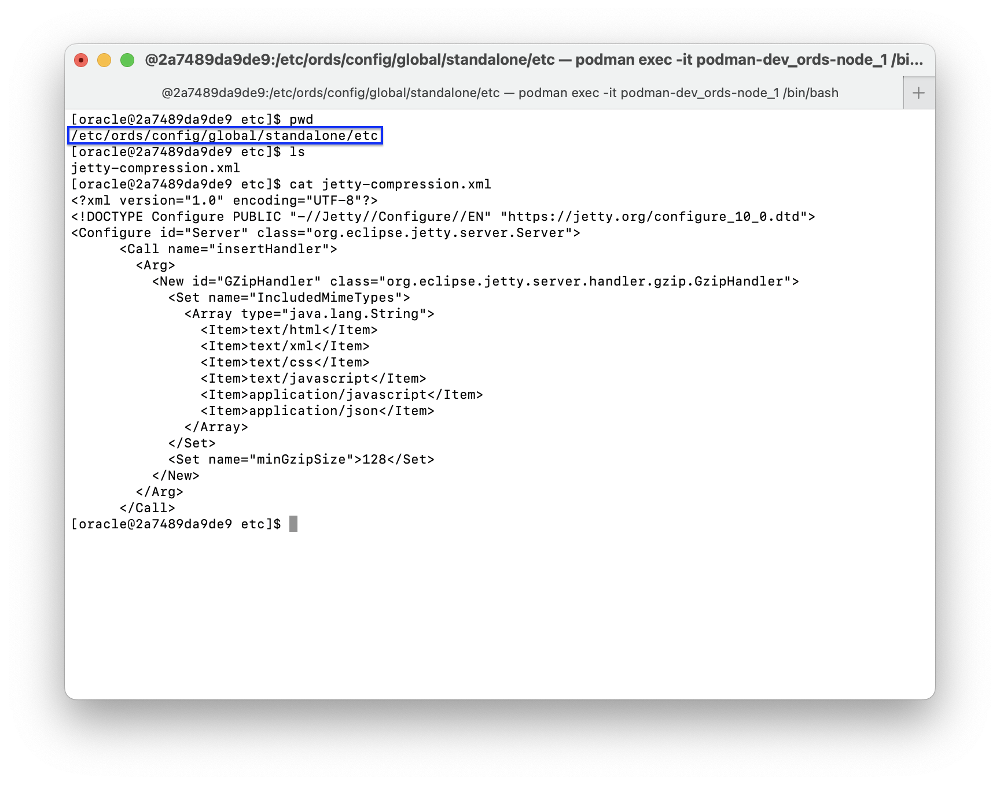
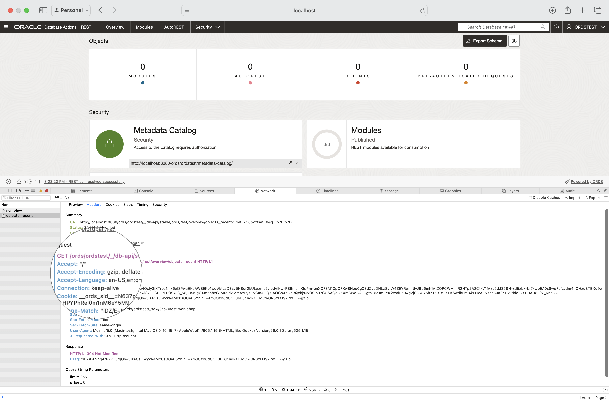

# GZip compression 

## Environment details

- **Last tested:** 04-NOV-2025
- **ORDS version used:** 25.3.1.r2891312
- **Jetty version used:** 12.0.25
- **Java version used:** GraalVM EE 21.3.10 for Java 17.0.11

## How to enable GZip compression in ORDS Standalone (Jetty)

To enable GZip compression in ORDS, add this file to your `/ords/config/global/standalone/etc` directory, and restart your ORDS instance.[^1] If you do not have a `/ords/config/global/standalone/etc` directory `cd` to the `standalone` directory, and then `mkdir etc`, then add the file.

  

[^1]:`GzipHandler` has been deprecated beginning with Jetty 12.1.1. [Link](https://javadoc.jetty.org/jetty-12.1/org/eclipse/jetty/server/handler/gzip/GzipHandler.html). This example was used with ORDS 25.3.1.r2891312; which ships with Jetty 12.0.25. 


### Sample file

Save this to your `/ords/config/global/standalone/etc` directory: 

```xml
<?xml version="1.0" encoding="UTF-8"?>
<!DOCTYPE Configure PUBLIC "-//Jetty//Configure//EN" "https://jetty.org/configure_10_0.dtd">
<Configure id="Server" class="org.eclipse.jetty.server.Server">
      <Call name="insertHandler">
        <Arg>
          <New id="GZipHandler" class="org.eclipse.jetty.server.handler.gzip.GzipHandler">
            <Set name="IncludedMimeTypes"> <!-- Sets the included filter list of MIME types (replacing any previously set) -->
              <Array type="java.lang.String">
                <Item>text/html</Item>
                <Item>text/xml</Item>
                <Item>text/css</Item>
                <Item>text/javascript</Item>
                <Item>application/javascript</Item>
                <Item>application/json</Item>
              </Array>
            </Set>
            <Set name="minGzipSize">128</Set> <!-- Sets the minimum response size (in Bytes) to trigger dynamic compression. -->
          </New>
        </Arg>
      </Call>
</Configure>
```

### Testing

Inspecting Request and Response headers, you'll see the new GZip compression included. 



\#compression \#jetty #jettyxml